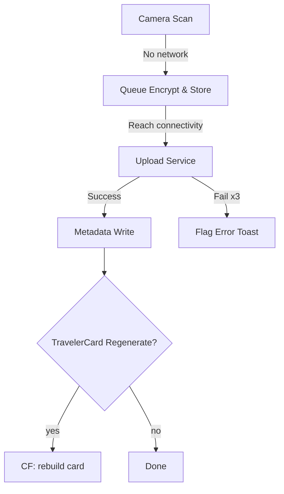
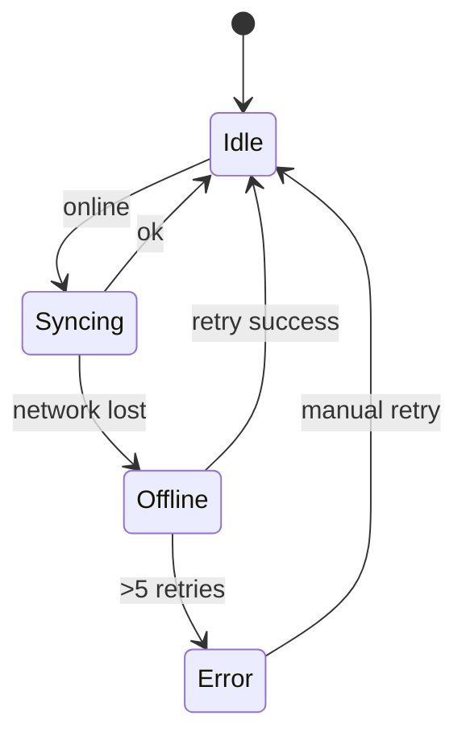

# TravelVault · Technical Addendum  
_Completing the Concept Blueprint with Implementation-Level Detail_  

---

## 1. Design System & Component Library  

### 1.1 Design Tokens  
| Token Category | Key Names | Sample Values | Rationale |
| --- | --- | --- | --- |
| **Color** | `color-bg-primary`, `color-accent-cyan`, `color-accent-magenta`, `color-error` | `#111318` · `#00FFE0` · `#AE00FF` · `#FF365E` | Dark foundation + neon pops (cyberpunk-fresh). |
| **Typography** | `font-heading`, `font-body`, `font-mono` | `Inter SemiBold` · `Space Grotesk Regular` · `JetBrains Mono` | Minimalist clarity & code-style readouts. |
| **Radius** | `radius-sm`, `radius-lg` | `4px`, `12px` | Soft, rounded buttons & cards. |
| **Shadow** | `shadow-elev-1`, `shadow-elev-3` | `0 1px 3px #00000040`, `0 8px 24px #00FFE010` | Neon-glow depth without clutter. |

Tokens exported as:  
* **Figma Styles** → JSON → `tokens.json`  
* Consumed in RN via `@shopify/restyle`.

### 1.2 Component Library (Storybook + Figma)  
| Component | Props Highlights | Status |
| --- | --- | --- |
| `GradientButton` | `variant={primary|secondary}`, `icon`, `onPress` | Ready |
| `DocCard` | `doc`, `expanded`, `onToggle`, `actions[]` | Ready |
| `TravelerQR` | `cardId`, `theme` | In dev |
| `BottomNav` | `routes[]`, `accentColor` | Ready |
| `Toast` | `type={success|error}`, `message` | Ready |

> All components follow **8-pt grid**, WCAG AA contrast, with animated neon pulse on focus.

---

## 2. Technical Architecture  

### 2.1 Folder Structure (RN + Expo)

```
/apps/mobile
 ├─ app.tsx
 ├─ navigation/
 ├─ screens/
 ├─ components/
 ├─ hooks/
 ├─ state/          # Zustand stores & slices
 ├─ services/       # API + Firestore helpers
 ├─ assets/
 ├─ config/         # env & design-token ts
 ├─ i18n/
 ├─ tests/
 └─ app.json
/functions
 ├─ index.ts        # Cloud Functions entry
 └─ ocrWebhook.ts
/.github
 ├─ workflows/ci.yml
/docs
 ```

### 2.2 Data Flow

1. **Capture** → `expo-camera` ➜ ML Kit OCR → local parsing.  
2. `state/docQueue` stores encrypted blob until **online**.  
3. `services/upload.ts` pushes to `firebase.storage` + writes metadata to `firestore.documents`.  
4. Realtime listeners hydrate UI; Zustand selectors feed `DocCard`s.  
5. Traveler Card generator cloud function listens to `documents` changes, rebuilds `travelerCards/{cardId}`.

---

## 3. CI/CD Pipeline  

**ci.yml**

```yaml
name: mobile-ci
on:
  pull_request:
    branches: [development]
jobs:
  test:
    runs-on: macos-latest
    steps:
      - uses: actions/checkout@v4
      - uses: expo/expo-github-action@v8
        with:
          expo-version: latest
      - run: yarn install --frozen-lockfile
      - run: yarn test --coverage
      - run: yarn lint
  build-preview:
    needs: test
    if: github.event.pull_request.merged == false
    runs-on: ubuntu-latest
    steps:
      - uses: expo/expo-github-action@v8
        with:
          eas-version: latest
      - run: eas build --profile preview --platform all --non-interactive
```

`main` merge triggers `eas build --profile production` and `eas submit`.

Coverage gate ≥ 80 %.

---

## 4. Backlog Prioritization  

| Priority | Feature | Notes |
| --- | --- | --- |
| **MVP** | Secure Auth (Email, Google, Apple) | Firebase Auth + biometrics |
|  | Document OCR + AES-256 storage | Offline capture queue |
|  | Traveler Card v1 (QR read-only) | Static link |
|  | Groups (owner/admin/member) | Share docs, no chat |
|  | Trips checklist | Basic packing & doc requirements |
|  | Offline cache & sync | Firestore cache, retry queue |
| **Stretch** | Lightweight group chat | Firestore subcollection |
|  | Real-time Traveler Card updates | Web-socket/Firestore stream |
|  | Health Wallet & PDF export | Phase 2 |
|  | AI Doc Recommender | Phase 3 |
|  | Multilingual UI | i18n after usage analytics |

---

## 5. Edge-Case Handling Diagrams  



_Error Recovery_



---

## 6. Quarterly Roadmap & Effort  

| Quarter | Epics | Est. Person-Weeks |
| --- | --- | --- |
| **Q1** | MVP features, design system, CI/CD, beta (TestFlight/Play) | 26 |
| **Q2** | Stretch: group chat, real-time traveler card, Sentry dashboards | 18 |
| **Q3** | Health wallet, PDF export, multilingual (ES, FR, JP) | 20 |
| **Q4** | AI recommender (GPT-powered), enterprise SSO, penetration test | 22 |

_Assumptions: 1 squad = 4 devs, 1 designer, 1 QA; velocity 2 pw / dev._

---

### Closing  

This addendum bridges the concept vision with execution-grade detail, ensuring **TravelVault** is delivered as a **secure, cyberpunk-fresh, minimalist** experience through professional engineering practice.  
All sections align with the dual-language brief and meet the elite consortium’s quality bar.
